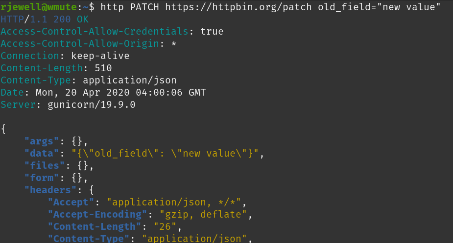

# HTTPie
HTTPie is a command line HTTP client that will make you smile.

There are complex guis (like Postman), and more arcane cli tools that can be used for making http requests. HTTPie is just brutally simple and convenient.

- [Homepage](https://httpie.org/)
- [Try Online](https://httpie.org/run)
- [Docs](https://httpie.org/docs)

Most notably, it uses simple verbs that map to standard HTTP actions, and body data is translated from ancillary command arguments. 

## Example
